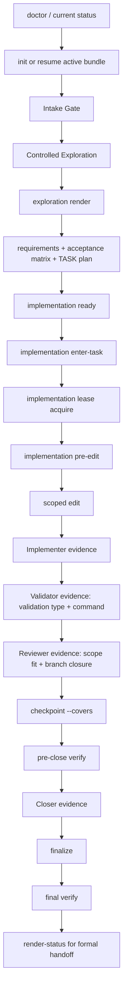

# Workflow

## Purpose

Use this reference for the normal idea-to-code lifecycle: initialize, route, update the compact bundle, pause/resume/archive, checkpoint, verify, and finalize.

## Skill Architecture Goal

idea-to-code is the skill-layer implementation path toward an intelligent, controllable delivery agent. The architecture is state first: the user's idea, clarified scope, branch decisions, TASK/REQ mapping, validation, review, and closeout evidence must live in the bundle and CLI records rather than in chat memory alone. Each self-improvement to the skill must use this same lifecycle so future agents can see why a rule exists, which branch it controls, how it was validated, and what remains deferred.

The workflow is successful only when every related idea branch is either implemented, deferred, rejected, superseded, blocked, or explicitly carried as risk. Do not let a conversation branch disappear because the latest user message changed focus.

## Bundle Contract

Every active bundle uses exactly:

```text
.idea-to-code/<slug>/
  00-idea.md
  01-progress.md
  02-report.md
  state.json
```

- `00-idea.md` records the idea, Intake Gate, Controlled Exploration, requirements, task classification, acceptance matrix, design, and implementation plan.
- `01-progress.md` records current phase, local records, role gates, milestones, verification history, risks, acceptance notes, and timeline.
- `02-report.md` is generated by `finalize`.
- `state.json` is the machine-readable source of truth.

Do not add ad hoc top-level Markdown files. `verify` rejects them.

Historical bundle ledgers are not default context. `.idea-to-code/<slug>/` directories persist so a user or agent can explicitly resume, inspect, verify, or audit a known task, but old bundle files must not be scanned as ordinary repository context. Read a historical bundle only when `current.json` points to it, the user explicitly names the slug or asks to inspect history, or a lifecycle command needs that slug. If `current.json` is missing, do not infer the current task by reading every bundle directory; use `current resume --slug <known-unfinished-slug>`, inspect `history/index.jsonl`, ask for the intended slug, or initialize a new bundle.

Ledger routing is session-ledger based by default. `current.json` tells you which session slug is active for the current conversation context. Continue the same slug for new ideas, clarifications, follow-ups, and corrections inside the same conversation session, but track each idea as an explicit IDEA/REQ/TASK scope. Start a new slug for a new chat session, an explicitly separate session/task, or a prior-session follow-up; when the old slug is known, reference it as `Related Session` / `Related IDEA` instead of moving old records. This prevents both failure modes: one slug per user utterance and one stale slug absorbing a different live session.

## Intake Before Implementation

The first user idea may be recorded immediately as task capture, but implementation cannot start until the intake is resolved.

`00-idea.md` must contain:

- `Understanding`
- `Assumptions`
- `Acceptance Criteria`
- `Need Confirmation`: `yes` or `no`
- `Confirmation Reason`

Use `Need Confirmation: yes` for ambiguous, risky, architecture-shaping, destructive, security-sensitive, expensive, or multi-interpretation work. Ask the user to confirm or correct the intake. `implementation ready` refuses to pass while confirmation is unresolved.

Use `Need Confirmation: no` for clear, low-risk, reversible work with concrete acceptance criteria. In that case, restate the intake and proceed.

If the user corrects or extends work after a bundle exists, do not delete or silently mix goals. Use `clarification`, `expand`, `switch`, `new-task`, or archive/cancel according to the latest request, update the plan when required, then rerun `implementation ready`. Corrections and new ideas inside the same conversation session stay in the same slug as distinct IDEA/REQ/TASK scopes. A follow-up from a different session starts a new session slug and cites the old session/IDEA when known.

## Controlled Exploration

Controlled Exploration happens after Intake Gate and before Task Classification. It is a planning section and a required user-visible Exploration Visibility Gate before READY, not a hidden note and not a second approval gate.

The rendered Exploration Visibility Gate separates `Planned Scope` from `Decision Options`. `Planned Scope` names required-now scope, deferred scope, and what READY can cover. `Decision Options` is only for mutually exclusive route choices. Do not present required scope items as user choices, and do not bury deferred or rejected scope inside option descriptions. Current bundles should record `Planned Scope` structurally in `00-idea.md`; fallback text is only for legacy bundle compatibility.

Use three display layers:

- `Exploration Result` / `Exploration Decision Request`: scope and route decision.
- `READY Focus`: current TASK/REQ execution info before edits.
- `Full Plan`: full task list for audit or explicit `--full-plan` use.

Default to `Exploration Needed: no`. Use `Exploration Needed: yes` only when the request has a real user-visible, architecture, API, cross-module, security, data, cost, migration, destructive-action, ambiguity, failure-cause, verification, or meaningful risk fork. Consider 2-4 options, record each as a hypothesis with fit, cost, risk, verification path, and rejection condition, then choose exactly one decision before `implementation ready`.

Use `Exploration Needed: no` when the task has one clear, low-risk implementation path. Record a concrete Trigger explaining why exploration is safely skipped.

Render the user-visible gate with:

```bash
python "$HOME/.codex/skills/idea-to-code/scripts/idea_to_code_bundle.py" exploration render --root "$(pwd)" --slug <slug>
```

When `Need Confirmation: no`, the visible output is `Exploration Result`: show `Planned Scope`, the selected approach, why it was chosen, and that implementation proceeds to READY. Do not ask for routine approval and do not show an option dump for simple single-path work.

When `Need Confirmation: yes`, the visible output is `Confirmation Required`: include `Planned Scope`, `Decision Options`, the recommended decision, and exact reply choices `approve`, `choose: <option>`, `change: <correction>`, `explore more: <direction>`, `pause`, and `cancel`. The user still confirms or corrects once; do not ask for a separate brainstorm approval. If the user asks to explore more, update Controlled Exploration, rerender the gate, and keep implementation blocked until Intake Gate becomes `Need Confirmation: no`.

Exploration Revision Rule:

- When the user responds to exploration by deferring scope, rejecting options, proposing a new route, or asking to explore more in a direction, record a plan-changing clarification/switch before READY.
- Generate a new `EXPLORATION_OUTPUT_ID` for the revised exploration. The prior output remains history, not current authorization.
- The revised output must explicitly show `Required Now`, `Deferred`, `Rejected Options`, `New / Selected Option`, and `What READY Will Cover`.
- If the user gives only a direction, generate revised candidate options from that direction and keep `Confirmation Required`; do not silently promote the direction to a selected route.
- If the user selects a clear route and no confirmation risk remains, use `Exploration Result` and proceed to READY only for `Required Now`.

Controlled Exploration should be recommendation-led. If the user's proposed implementation is flawed, treat it as a candidate, explain the issue, recommend a better default path, and ask for confirmation only when that recommendation creates a real product, security, data, cost, or architecture fork. Do not dump choices on the user or ask repeated routine confirmations after the path is approved.

## Script And Test Ownership

`idea_to_code_bundle.py` and `test_idea_to_code_bundle.py` are unified skill resources, not per-project files.

- The script lives once in the skill and operates on any project by writing that project's local `.idea-to-code/` bundle.
- The regression test suite lives once in the skill and validates the skill workflow across simulated task scenarios.
- Each user project owns only its `.idea-to-code/<slug>/` task data, `current.json`, and `history/index.jsonl`.
- Do not copy the script or tests into every project unless a project deliberately vendors the whole skill.

Most reasonable future split:

- Keep one public CLI entrypoint so existing invocation stays stable.
- Move state loading, locking, and writes into a state module.
- Move Markdown rendering and section replacement into a document module.
- Move verify/finalize gate checks into a verification module.
- Split tests by behavior: artifact contract, routing/current state, role gates, verification/finalize, and reference structure.
- Do not split until the current regression suite is green and a dedicated migration task is active.

## Generated Test Ownership

When this skill creates tests during a user task, choose and record one ownership value:

- `persistent-product-test`: a test intentionally added to the project's normal test suite and expected to remain after the task.
- `project-native-test`: a test added in the project's native test layout, framework, or naming convention while still being generated by idea-to-code.
- `task-evidence-only`: a one-off script, fixture, log, screenshot, or probe used only as evidence for this task.

Persistent generated tests must be distinguishable from pre-existing project tests. Use one of these shapes unless the project has a stronger local convention:

```text
tests/idea_to_code/<slug>/test_<requirement_or_feature>.py
tests/integration/test_idea_to_code_<slug>_<feature>.py
e2e/idea-to-code/<slug>/<flow>.spec.ts
```

Evidence-only material belongs under the active bundle:

```text
.idea-to-code/<slug>/artifacts/
```

For every generated test or evidence script, record these fields in `01-progress.md` / `state.json` evidence and name them in `02-report.md` when finalized:

- `Test Ownership`: `persistent-product-test`, `project-native-test`, or `task-evidence-only`
- `Test file`: project-relative path or bundle artifact path
- `Covers`: REQ IDs covered
- `Validation Type`: one of the approved validation types

Do not leave generated tests ambiguous. If a test should run with the product permanently, put it in the project test tree with `idea_to_code` or the task slug in its path/name. If it only proves this task, keep it in `.idea-to-code/<slug>/artifacts/`.

## Normal Lifecycle

Lifecycle Gate Diagram:



1. Run `doctor` or `current status`.
2. Initialize or resume the active bundle. Use only the active `current.json` bundle or an explicitly requested slug; historical ledgers remain inert by default.
3. Fill Intake Gate, Controlled Exploration, and `00-idea.md` sections through `update`.
4. Register REQ IDs.
5. Run or reuse `exploration render` and surface its `EXPLORATION_OUTPUT_ID` in a normal assistant message. `implementation ready` refreshes this output before READY when needed, but visibility is still a user-message obligation.
6. Run `implementation ready` only after `Need Confirmation: no`, Controlled Exploration has either been skipped with a concrete Trigger or resolved with options and a decision, and the Exploration Visibility Gate output is current for the plan revision.
7. Before any tracked repository or artifact edit, run the non-bypassable pre-edit self-check: confirm the current user-visible conversation already contains the Exploration Visibility Gate output plus the focused READY TASK excerpt for the exact TASK/REQ and files about to be edited. If either is missing, do not edit. Run or reuse `exploration render` and `implementation ready` / `implementation enter-task --task <TASK-ID>`, paste the relevant outputs in normal assistant messages, and continue only after they are visible. Then run `implementation pre-edit --task <TASK-ID> --file <path>` for one file or grouped `--files <path>...` for multi-file TASKs. `pre-edit` must print `PRE_EDIT_OK_ID`; if it refuses, do not edit. `implementation ready` and `implementation show-ready` default to the first TASK/IMP focused excerpt; use `--full-plan` only when the full audit list needs to be printed. Every current TASK transition needs visible task info for that TASK before edits begin, not just one full list at the beginning. `enter-task` is the preferred path because it records `current_task_id` without rotating the existing `READY_TASK_OUTPUT_ID`; `show-ready --task` is a display fallback only when state mutation is impossible. This includes code, docs, tests, config, scripts, and tracked bundle artifacts. Reusing READY still requires showing the relevant excerpt again before the current edit unless the user explicitly waived repeated visibility after an initial visible READY excerpt. Command stdout, folded transcript output, internal notes, or a READY message printed after edits have already started are not compliant for those earlier edits. The compliance artifact is the assistant-visible message body, not the command output that generated it.
8. Record Planner evidence.
9. Implement a TASK/IMP slice.
10. Record Implementer, Validator, and Reviewer evidence.
11. Record a checkpoint with `--covers`.
12. Run pre-close `verify`.
13. Record Closer evidence.
14. Run `finalize`.
15. Run final `verify`.
16. Before a final tracked handoff for install, validation, commit, delivery, blocked, review, keep/revise/rollback, or final status, run `render-status` first. If `render-status` is unavailable or fails, state that reason and then use the fixed Console Response Contract fields manually. If `render-status` succeeds, the assistant-visible final body must preserve the fixed fields from that output; a natural-language summary that merely says the helper ran is noncompliant.

## Output Compliance Testing

After changing Exploration Visibility Gate output, READY visibility, role/source prefixes, validation status wording, noncompliance reporting, or final handoff formatting, run or update the multi-role output compliance scenario in `references/roles-and-state.md#multi-role-output-compliance`.

After changing lifecycle closure rules, current TASK entry behavior, overview output, or ordinary-answer boundaries, also update or run the same scenario plus the fresh-session benchmark prompts in `references/controlled-exploration-benchmark.md`. Record what passed, what failed, and whether failures were instruction gaps, script gaps, or model-output drift.

Context boundary: agents may read `.idea-to-code/current.json` to identify the active slug. They must not treat the active slug directory, historical slug directories, `00-idea.md`, `01-progress.md`, `state.json`, or artifact files as default context. Read a slug directory only when the user explicitly asks to inspect or resume it, or when a lifecycle command needs that bundle. Task-specific scenario run results may be recorded under the active `.idea-to-code/<slug>/artifacts/` directory as evidence, but those evidence files are not default context and are not regression-test inputs.

Workflow owns the lifecycle trigger and context boundary. `roles-and-state.md` owns the role-by-role expectations, ordinary-answer boundary, and run protocol. Keep this split when future output-compliance rules are added.

Branch closure checks for output compliance:

Lifecycle invariant contract: every branch below must be represented in `branch-map --json` and must pass `lifecycle-audit --json`. A branch is closed only when it has `owner`, `gate`, `evidence`, `test`, `closeout_surface`, and `enforcement_boundary`. Do not add branch prose without updating the map and tests. Do not claim a branch is fully controlled when its `enforcement_boundary` is `host-required`; surface it as an external integration or residual risk instead.

- Branch coverage map branch: use `branch-map --json` to inspect the lifecycle branch coverage map. Each branch exposes `id`, `workflow_branch`, `entry`, `exit`, `validation`, and `failure_handling`. The map mirrors the branch closure checks in this section and is a control overview, not proof that a live agent followed the branch.
- Tracked edit branch: visible Exploration Visibility Gate output and focused READY exist for the exact TASK/REQ and files before the edit tool runs.
- Delegation evidence branch: independent/subagent/fresh-agent/hybrid-team/independent-team claims require `delegation record --status usable` for the current plan revision. Planned, timed-out, unusable, or unverified attempts remain visible through `delegation status`, `verify`, and `render-status` and do not count as independent evidence. If the workflow falls back to same-agent or accepts the failed attempt as a known risk, close the finding with `delegation resolve`; resolution removes the closeout blocker but does not turn the failed attempt into independent evidence.
- Same-session continuity branch: when a user message is related to earlier session work, audit the prior related scope before answering, planning, or claiming completion. Record material follow-ups with `session audit --relation same-scope|scope-correction|new-related-scope|unrelated`. When the follow-up changes, defers, rejects, completes, or reopens a material idea, also update `idea record` so `idea status` carries stable `IDEA-*` continuity across turns. State whether the message is `same scope`, `scope correction`, `new related scope`, or `unrelated ordinary answer`; do not answer from only the newest bundle when earlier same-session context is material.
- Idea ledger branch: use `idea record --id IDEA-* --status active|completed|deferred|rejected|superseded|blocked|reference --summary "<summary>" --related-reqs "<REQs>" --notes "<trace notes>"` for material same-session ideas that formal status may later cite. Use `idea status` before answering "where are we", "is all done", or any follow-up that refers to prior ideas. Multiple idea records require IDEA/TASK/REQ mapping in formal tracked status.
- Scope classification branch: when a follow-up could change or relate to active scope, record `scope classify --classification same-scope|scope-correction|new-related-scope|unrelated` before planning, editing, or claiming tracked status. Related corrections are not ordinary answers; unrelated questions are not forced into tracked work.
- Master backlog branch: when one related request contains multiple issues or work items, assign stable `MB-*` IDs and run `backlog sync` before READY. READY and closeout must keep pending/deferred MB IDs visible; accepted closeout is refused while master backlog items remain incomplete.
- Enumerated scope branch: numbered issue lists are stable scope IDs. A later list with the same visible numbers must preserve the previous meanings, or the output must show a mapping table with `Previous ID`, `Current ID`, and `Change Reason` before planning, READY, validation, or status claims use the new numbering.
- Current TASK entry branch: `implementation enter-task --task <TASK-ID>` records the current task and prints READY Focus before edits for that TASK; `show-ready --task` is only a fallback with a recorded reason.
- Implementation lease branch: `implementation lease acquire --task <TASK-ID> --owner <owner> --file <path>` or grouped `--files <path>...` records active write ownership for current TASK files before pre-edit for every tracked implementation edit, including same-agent work. Overlapping active leases for different owners are refused. `implementation lease status` exposes active/released leases, `implementation lease release --id <LEASE_ID> --reason <reason>` releases ownership, and finalize closes any remaining active leases so completed bundles do not imply live write ownership. Read-only Validator/Reviewer subagents do not acquire write leases unless they edit files.
- Pre-edit guard branch: `implementation pre-edit --task <TASK-ID> --file <path>` or grouped `--files <path>...` checks active bundle, current Exploration, current READY, matching current TASK, current TASK entry freshness, and TASK file coverage. It prints `PRE_EDIT_OK_ID`, appends a durable `pre_edit_records` entry, and Implementer evidence must cite the current guard ID. The current TASK is not compliant until every planned edit file has current guard coverage.
- Tool-layer edit wrapper branch: `implementation guarded-apply --task <TASK-ID> --patch-file <path>` is the default tracked edit path for patch-expressible edits. It resolves the active bundle, checks patch paths, confirms visible Exploration and READY Focus for the current TASK, requires a non-overlapping lease, calls `implementation pre-edit`, verifies all patch paths are listed under the current TASK, captures `PRE_EDIT_OK_ID`, runs `git apply --check`, and applies the patch with `git apply`. If a tracked edit cannot use `guarded-apply`, the Implementer evidence must record a fallback reason and still cite the current `READY_TASK_OUTPUT_ID` and `PRE_EDIT_OK_ID`; fallback edits are not wrapper-compliant. Current Codex-native edit tools are not host-level blocked by this skill, so native-tool bypass remains a `residual risk`, not a solved control.
- Pre-edit noncompliance branch: if an edit starts without the valid guard, run `implementation noncompliance --task <TASK-ID> --reason "<reason>" --file <path>` as remediation evidence. Open events must appear in `implementation status`, `verify`, and `render-status`; accepted closeout cannot treat them as complete work.
- Plan-correction branch: correcting bundle planning files is allowed only to make READY accurate; implementation edits wait for refreshed visible READY.
- Read-only status branch: no pre-edit READY is required because no file edit starts; formal tracked status still uses `render-status`.
- Ordinary-answer branch: no pre-edit READY and no fixed status template; concise natural answer with the role/source prefix is expected.
- Formal tracked handoff branch: `render-status` runs first, or the response states why it could not and then uses the fixed fields manually.
- Display artifact branch: `tool_stdout` and `assistant_visible_body` are separate compliance artifacts. Required `Exploration Result`, `Implementation Gate: READY`, and `render-status` blocks must be present in `assistant_visible_body`; presence only in command output is a failure.
- Skill self-validation branch: when validating idea-to-code itself and a single full unittest command is too slow or flaky, use the official chunked runner `test-batch --chunk-size 40 --timeout-seconds 180`. Record the total test count, chunk count, and pass/fail output as validation evidence.
- User-facing language branch: keep bundle/state/protocol content English-only ASCII, but write meaningful explanatory prose, recommendations, caveats, and conclusions in the user's language by default. Do not translate entries from `SKILL.md#Protocol Glossary / Do-Not-Translate List`, including role/source prefixes, role names, fixed fields, IDs, commands, file paths, validation types, or role evidence. Add new protocol terms to that glossary instead of inventing localized variants.
- Weakness review branch: architecture or process weakness lists must use the `SKILL.md#Risk And Weakness Taxonomy` labels: `already hardened`, `residual risk`, `new gap`, or `external validation`. Do not turn a residual risk into a new task unless the remaining failure mode is concrete.
- Enforcement boundary branch: every weakness or residual-risk review must also label the boundary as `repo-enforced`, `skill-enforced`, or `host-required`. Host-required risks such as native edit-tool interception or unavailable fresh-session runners must not be repeatedly turned into repo-only TODOs.
- Noncompliance branch: late READY or late pre-edit is recorded as noncompliant remediation and is not counted as proof the earlier edit followed the rule.

## User-Visible Role Display

Every user-visible idea-to-code message starts with a role/source prefix. The role is one of `Planner`, `Implementer`, `Validator`, `Reviewer`, or `Closer`. The source is `agent` when the current assistant performs that role and `subagent` only when a real subagent ran and returned usable evidence.

Examples:

```text
[idea-to-code][Planner/agent] Mode: delivery | Bundle: <slug> | Gate: ready
[idea-to-code][Validator/subagent] Mode: validation | Bundle: <slug> | State: reviewing evidence
[idea-to-code/<profile-name>][Planner/agent] Implementation Gate: READY | Bundle: <slug>
```

Role labels are display labels, not extra lifecycle states. Do not remove or shorten existing READY TASK, confirmation, validation, or closeout fields when adding the role/source prefix.

READY list complexity note: for broad ideas with many TASKs, do not merge the Exploration Visibility Gate and READY into one large undifferentiated block. Exploration explains planned scope and why the selected plan is appropriate; focused READY explains the next executable TASK. The full READY plan remains in `00-idea.md` and can be printed with `--full-plan` for audits. A later extension may add grouped or summarized READY overviews, but focused per-TASK READY output remains the execution contract.

## Routing User Input

Use `route --input "<English summary>"` when the relationship to the active task is unclear.

Classifications:

- `continue`: same task, no scope change.
- `expand`: same task, adds requirements or boundary cases; use `--changes-plan yes`.
- `switch`: replaces current direction inside the same task; use `--changes-plan yes`.
- `new-task`: unrelated work; record it, archive current, then initialize a new bundle.
- `status`: read-only status answer.
- `pause`: pause current work.
- `blocked`: external dependency blocks work.
- `clarification`: user corrected target or acceptance; use `--changes-plan yes`.
- `no-op`: no tracked effect.

`pending_plan_update` blocks product-code edits until every section named by `pending_plan_update_sections` is updated and `implementation ready` is rerun. A partial update must keep the remaining named sections stale. Older bundles without section metadata keep the legacy boolean gate and should refresh the plan before coding.

Add requirements before READY whenever possible. A post-READY or post-execution `requirement add` invalidates READY and requires refreshing requirements/design/implementation. Requirement removal after READY or execution evidence remains refused.

Session-Ledger Routing Scenarios:

| Scenario | Expected ledger decision | Slug count behavior |
|---|---|---|
| `idea1` plus several clarifications before implementation finishes | Continue same session slug with `clarification` or `expand` | One slug for the session |
| Same chat: `idea1` completes, then user asks unrelated `idea2` | Continue same session slug and add an IDEA-2 scope | One slug with multiple IDEA scopes |
| Same chat: user reports a defect in delivered `idea1` after `idea2` completed | Continue same session slug and add an IDEA-1 follow-up TASK/REQ | One slug; old IDEA scope remains auditable |
| Later session: user reports a defect in prior-session `idea1` | Initialize a new session slug and reference the old session/IDEA | New related session slug; old ledger remains historical |
| User says "fix the earlier thing" and multiple old bundles could match | Ask a concise scope question or inspect explicit current/history metadata read-only | No mutation until scope is clear |
| User changes wording but stays in the same conversation session | Continue current slug; add or update the scoped IDEA/REQ/TASK | Slug count remains controlled |

## Multi-Agent Ledger Ownership

When several agents or subagents work at the same time, ledger ownership still follows session scope:

- Same session: one shared slug, with explicit IDEA/TASK/REQ ownership and disjoint file/module write boundaries before edits.
- Different live chat sessions: separate slugs, even if work happens in the same repository or same wall-clock window.
- Validator/Reviewer subagents: record evidence in the parent slug; do not start a new slug for review-only or validation-only work.
- Worker subagents: use the parent slug only for disjoint implementation slices of the same session/IDEA scope; otherwise initialize a separate session slug.
- Before mutating current state, each agent must re-read `current status` or `.idea-to-code/current.json`. If another agent archived, initialized, set, or resumed a different current bundle, stop and reroute instead of writing to stale state.
- A current pointer conflict should resolve by one agent succeeding and the other receiving a clear refusal or rerouting instruction; it must not silently overwrite an unfinished current bundle.

## Key Commands

```bash
python "$HOME/.codex/skills/idea-to-code/scripts/idea_to_code_bundle.py" contract
python "$HOME/.codex/skills/idea-to-code/scripts/idea_to_code_bundle.py" doctor --root "$(pwd)"
python "$HOME/.codex/skills/idea-to-code/scripts/idea_to_code_bundle.py" init --root "$(pwd)" --slug "<slug>" --title "<title>" --unique --idea "<seed>"
python "$HOME/.codex/skills/idea-to-code/scripts/idea_to_code_bundle.py" update --root "$(pwd)" --slug "<slug>" --file requirements --content-file ./requirements.md
python "$HOME/.codex/skills/idea-to-code/scripts/idea_to_code_bundle.py" requirement add --root "$(pwd)" --slug "<slug>" --id REQ-1 --description "<requirement>" --type functional
python "$HOME/.codex/skills/idea-to-code/scripts/idea_to_code_bundle.py" implementation ready --root "$(pwd)" --slug "<slug>"
python "$HOME/.codex/skills/idea-to-code/scripts/idea_to_code_bundle.py" role record --root "$(pwd)" --slug "<slug>" --role planner --evidence "<evidence>" --covers "REQ-1"
python "$HOME/.codex/skills/idea-to-code/scripts/idea_to_code_bundle.py" checkpoint --root "$(pwd)" --slug "<slug>" --milestone "<name>" --delivered "<what changed>" --verified "<validation type and evidence>" --next "<next>" --focus "<focus>" --gate "<gate>" --gate-status pass --covers "REQ-1"
python "$HOME/.codex/skills/idea-to-code/scripts/idea_to_code_bundle.py" verify --root "$(pwd)" --slug "<slug>"
python "$HOME/.codex/skills/idea-to-code/scripts/idea_to_code_bundle.py" rebuild-progress --root "$(pwd)" --slug "<slug>"
python "$HOME/.codex/skills/idea-to-code/scripts/idea_to_code_bundle.py" finalize --root "$(pwd)" --slug "<slug>" --summary "<summary>" --verification "<validation type and evidence>" --risks "<risks>" --acceptance "<scope delivered>" --gate-status pass --decision accepted
```

## Pause, Block, Archive

- Use `current pause` when the user pauses work.
- Use `current resume` only after the user resumes.
- Use `current resume --slug <known-unfinished-slug> --reason "<reason>"` when `.idea-to-code/current.json` is missing after interruption or reboot and the user knows the unfinished slug. The command safely restores that slug as current and resumes it if it was paused.
- Use `block` for external dependencies and `unblock` when resolved.
- Use `current archive` before starting an unrelated task while work is unfinished.
- Do not use `current clear` to hide unfinished work.

## Preflight

Before product-code edits:

- Confirm project root and stack.
- Read project governance files reported by `doctor`.
- Identify build/test commands.
- Run the baseline build/test when practical.
- Check for stale long-running servers before end-to-end tests.
- If untouched source-level baseline fails, report it before implementing.

## Finalize Rules

`finalize` is part of the work. It refuses accepted/pass closeout when required files, role evidence, validation types, acceptance matrix, trace coverage, or pre-close verify are missing.
