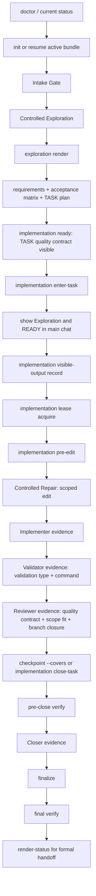

# Workflow

## Purpose

Use this reference for the normal idea-to-code lifecycle: initialize, route, update the compact bundle, pause/resume/archive, checkpoint, verify, and finalize.

Ownership boundary: this file owns lifecycle order, bundle routing, branch closure, context boundaries, and command flow. Evidence strength, acceptance semantics, final response compliance, installed parity, and screenshot/runtime artifact quality live in `verification-and-evidence.md`. Benchmark prompts and scoring live in `controlled-exploration-benchmark.md`; do not treat benchmark scenarios as runtime command authority.

## Item-by-item delivery loop

The human-facing unit is a numbered Plan item. Map original numbers to existing
`MB-*` records when a master backlog is required; link each confirmed outcome to
`REQ-*` and its executable `TASK-*` slices. Do not add a second Plan database or
force these IDs into a one-to-one relationship. A one-item request uses the same
loop without manufacturing a multi-item backlog.

| Phase | Decision before moving on | Visible role and result |
| --- | --- | --- |
| Idea | Outcome, original meaning, scope and authorization understood | Planner: restated goal; ask only for material missing user decisions |
| Plan | Enumerate candidates, screen obvious non-goals, record dependencies and possible groups | Planner: original numbers, tentative status and current item |
| Explore one item | Read actual code and evidence, establish or refute the issue, challenge impact and alternatives | Planner: confirmed / no change / unverified / blocked, with reason |
| Design and READY | Feasible correction and independent acceptance cases; affected paths read | Planner: current scope, selected approach and verification boundary before edits |
| Implement | Scoped code achieves the design; derived work classified | Implementer: material changes or reason to return to design |
| Test | Compare observed outcome with requirement, including applicable real path | Validator: evidence type, result and missing coverage |
| Review and item result | Reconcile requirement, diff, evidence and remaining risks | Reviewer: item disposition and next action; close current TASK before switching |
| Overall closeout | Every original number has an evidence-backed disposition | Closer: completed, no-change, deferred and blocked outcomes, plus delivery state |

The canonical tracked-edit order is `implementation ready` -> `implementation
enter-task` -> show the full assistant-visible Exploration and READY Display
Layer -> `implementation visible-output record` -> `implementation lease
acquire` -> `implementation pre-edit` -> edit. Recording before task entry is
invalid because the record is bound to `current_task_id`.

Screening the list is not collective exploration or acceptance. Read shared
context as needed, then investigate and conclude each item in the agreed order.
Group confirmed identical root causes only under the existing independent
numbered-point rule in `planning-patterns.md`. Preserve each member's evidence.

Failure returns to its cause: unclear intended behavior -> Idea/Plan; inadequate
design -> exploration and affected plan; implementation defect -> current TASK;
invalid test oracle or environment -> validation preparation. Apply the existing
Controlled Repair rules rather than starting a new lifecycle for every failure.
An ordinary code error does not itself justify a new skill rule. Reusable
mechanism gaps enter the evidence-backed improvement procedure below.

No supported solution is a legitimate item result. Record why and what would
unblock it; proceed only to independent work permitted by the user's sequencing
constraint. Never carry an unexplained partial mutation into the next item.
An audit finding refuted by evidence can be completed as an investigation with
zero code changes; describe it as `no change`, not a repaired defect. Do not
invent an edit TASK or READY solely to dispose of a read-only finding.

For a multi-item bundle, `backlog sync` activates this lifecycle. Run `backlog
begin` for the earliest unresolved `MB-*`, record inspected-code evidence, and
run `backlog conclude` with one of `confirmed`, `no-change`, `rejected`,
`unverified`, `deferred`, or `blocked`. A confirmed item stays current while its
REQ/TASK work is implemented; checkpoint coverage of all REQs mapped to that MB
marks it completed. Every other disposition is a recorded item result and must
not create a synthetic REQ or TASK. The controller refuses READY before a
confirmed disposition and refuses beginning a later item while an earlier item
remains unresolved.

For multi-issue work, assign stable `MB-*` IDs and run `backlog sync` before READY; the strong flow then requires begin and conclude for the earliest unresolved item, and accepted closeout is refused while master backlog items remain incomplete.

### Worked example: one fix, one disproven suspicion, one blocker

This is a hypothetical walkthrough, not executed acceptance evidence. The
controller's rendered Exploration/READY and final status contracts still apply;
the progress messages below do not substitute for an edit gate.

1. **Plan:** `1. category contract; 2. scheduled acquisition; 3. remote recovery`.
   Record 2 and 3 as pending, not pre-judged. Establish original behavior and
   permitted changes for item 1 first.
2. **Explore 1:** reproduce a classified label disappearing at validation;
   trace persistence and consumers. Reject copying source-specific filters into
   every adapter because that would expand semantics. Select the smallest fix.
3. **Execute 1:** declare REQ/TASK and acceptance cases, render and visibly show
   current Exploration/READY, enter the current TASK, record visibility, lease
   and pre-edit, then change code. Diagnose a failing assertion: when the
   approved contract and test oracle are valid and implementation is wrong,
   repair the current TASK; otherwise return to the affected design or validation
   preparation. Do not weaken the test merely to pass. Run applicable real
   persistence checks, review, checkpoint and emit the item result:
   `[idea-to-code][Reviewer/agent] Plan 1: verified; evidence recorded; next: Plan 2`.
4. **Explore 2:** inspect the actual external scheduler and its configuration.
   Evidence disproves the missing-acquisition suspicion. Record the observation
   and conclude `[idea-to-code][Reviewer/agent] Plan 2: no change; scheduling exists`.
   Do not add another cron entry just to produce a modification.
5. **Explore 3:** read available code, but required remote credentials are absent.
   State exactly which runtime claim remains unknown. Record blocked status and
   resume action; do not call simulated results real-server acceptance.
6. **Overall:** render a Blocked handoff, with 1 verified, 2 no change,
   3 blocked, no hidden completion, and actual commit/deployment status. On
   resume, read the current ledger and retry item 3 from its recorded boundary;
   do not reopen the accepted fix without new contradictory evidence.

If checkpoint evidence omits its validation type, the controller rejects the
input before appending records. Correct the description to match the actual
evidence and retry; do not fabricate evidence or edit state to claim success.

When command shape is uncertain, use the read-only command guide before retrying:

```bash
python "$HOME/.codex/skills/idea-to-code/scripts/idea_to_code_bundle.py" command-guide --flow implementation-edit
python "$HOME/.codex/skills/idea-to-code/scripts/idea_to_code_bundle.py" command-guide --flow closeout --json
```

If a lifecycle command prints argparse usage or a missing-required-argument error, do not continue guessing variants. Run `command-guide --flow <flow>` or the targeted subcommand `--help`, then retry with a complete command shape.

For clear, low-risk, one-file tasks, prefer the `fast-lane` command over hand-assembling a bundle. It reuses quickstart eligibility and refuses broad, risky, ambiguous, destructive, or multi-file work. When refused, fall back to `init` plus the normal intake, exploration, READY, visible-output, lease, and pre-edit sequence.

Before closeout or a formal tracked handoff, use `evidence closeout` when you need a read-only summary of current bundle evidence:

```bash
python "$HOME/.codex/skills/idea-to-code/scripts/idea_to_code_bundle.py" evidence closeout --root "$(pwd)" --slug "<slug>"
```

This command summarizes existing verify, delegation, fresh-benchmark, latest milestone, render-status recommendation, and next action state. It does not run missing validation, import fresh evidence, finalize, or prove claims that have not already been recorded.

After manually editing `00-idea.md`, run a read-only structure check before READY:

```bash
python "$HOME/.codex/skills/idea-to-code/scripts/idea_to_code_bundle.py" implementation plan-check --root "$(pwd)" --slug "<slug>" --json
```

If `ok` is false, fix the TASK/IMP markdown sections before running `implementation ready` or editing files. Treat pollution failures as hard blockers: copied bundle headings, unresolved placeholders, or template residue inside `Files`, `Execution Details`, `Implementation Quality Contract`, `Done Criteria`, or `Planned Verification` can make READY Focus misleading even when the section is non-empty.

## Skill Architecture Goal

idea-to-code is the skill-layer implementation path toward an intelligent, controllable delivery agent. The architecture is state first: the user's idea, clarified scope, branch decisions, TASK/REQ mapping, validation, review, and closeout evidence must live in the bundle and CLI records rather than in chat memory alone. Each self-improvement to the skill must use this same lifecycle so future agents can see why a rule exists, which branch it controls, how it was validated, and what remains deferred.

The workflow is successful only when every related idea branch is either implemented, deferred, rejected, superseded, blocked, or explicitly carried as risk. Do not let a conversation branch disappear because the latest user message changed focus.

## Driving the current task

The bundle drives the delivery sequence; the executing agent supplies judgment and tool actions. On entry or resume, recover the original objective, applicable user authorization, current exploration decision, TASK/REQ scope, evidence gaps and next action from the active bundle. Choose the next step for that phase: resolve a real exploration question, implement the current task, validate its observable result, or close the supported scope. Do not replace this direction with an unrelated plan held only in chat.

At a session or agent boundary, recover the applicable interaction preferences and constraints as well as the task: user language and requested response scope, authorized actions and limits, original objective, current TASK/REQ, unresolved evidence and next action. Use the current pointer and its named records, or the explicitly assigned bundle; do not scan unrelated history. Check current instructions, task state and relevant version before dependent work. A handoff should carry these material decisions and their provenance without copying the entire conversation or introducing a new mandatory output form. Summaries are continuity aids, not additional authority: a stale summary cannot override a later user instruction, and a role change neither expands authorization nor requires renewed permission for already authorized work.

An explicitly authorized baseline commit preserves a repository state; it does not make that state accepted delivery. Follow the user's commit scope and retain known failed or unverified acceptance items, the original repair goal and next action in the existing bundle. Do not infer release, deployment or acceptance authorization from the commit, and do not invent another approval gate for an action already authorized.

Before acting on a new tracked request, record its classification and material decision through the existing user-input, plan or local decision records. Capture the chosen action, its basis and affected scope before dependent work; unresolved product or permission decisions keep only their dependent action pending. A current concrete decision can already authorize routine next steps. Do not repeat approval requests or every controller command before each safe operation when the current state, scope and evidence are sufficient. Use `implementation next-action` or `evidence closeout` to resolve missing or conflicting state, while retaining the existing required edit and acceptance gates.

An executing agent may make ordinary corrections and implementation choices within approved scope. Supervisory observation is an explicit check of that execution against the goal, constraints and evidence, not an invisible second model. Record a material intervention in the owning bundle with the observer, observed facts, reason, affected TASK/REQ/files or acceptance claim, selected correction, and next action. If work is interrupted or moved, preserve the original root/bundle/task and resume point. Stop an unsafe action immediately; complete the record before resuming dependent work. Update the plan or use the existing scope/closure path when the intervention changes it, and invalidate acceptance claims that the new evidence no longer supports.

Return to the original task after the correction or explicitly record its remaining blocker or disposition. A workflow-improvement detour follows the existing linked improvement and resume procedure below; it does not silently become the business objective. Observation alone neither authorizes broader changes nor requires a new approval gate. At handoff, leave the current direction and any unresolved intervention readable in the bundle so the next executor need not reconstruct responsibilities or decisions from this conversation.

## Bundle Contract

Every active bundle uses exactly:

```text
.idea-to-code/<slug>/
  00-idea.md
  01-progress.md
  02-report.md
  state.json
```

- `00-idea.md` records the idea, Intake Gate, Controlled Exploration, requirements, task classification, acceptance matrix, design, and implementation plan.
- `01-progress.md` records current phase, local records, role gates, milestones, verification history, risks, acceptance notes, and timeline.
- `02-report.md` is generated by `finalize`.
- `state.json` is the machine-readable source of truth.

Do not add ad hoc top-level Markdown files. `verify` rejects them.

Historical bundle ledgers are not default context. `.idea-to-code/<slug>/` directories persist so a user or agent can explicitly resume, inspect, verify, or audit a known task, but old bundle files must not be scanned as ordinary repository context. Read a historical bundle only when `current.json` points to it, the user explicitly names the slug or asks to inspect history, or a lifecycle command needs that slug. If `current.json` is missing, do not infer the current task by reading every bundle directory; use `current resume --slug <known-unfinished-slug>`, inspect `history/index.jsonl`, ask for the intended slug, or initialize a new bundle.

Ledger routing is session-ledger based by default. `current.json` tells you which session slug is active for the current conversation context. Continue the same slug for new ideas, clarifications, follow-ups, and corrections inside the same conversation session, but track each idea as an explicit IDEA/REQ/TASK scope. Start a new slug for a new chat session, an explicitly separate session/task, or a prior-session follow-up; when the old slug is known, reference it as `Related Session` / `Related IDEA` instead of moving old records. This prevents both failure modes: one slug per user utterance and one stale slug absorbing a different live session.

## Intake Before Implementation

The first user idea may be recorded immediately as task capture, but implementation cannot start until the intake is resolved.

`00-idea.md` must contain:

- `Understanding`
- `Assumptions`
- `Acceptance Criteria`
- `Need Confirmation`: `yes` or `no`
- `Confirmation Reason`

Use `Need Confirmation: yes` for ambiguous, risky, architecture-shaping, destructive, security-sensitive, expensive, or multi-interpretation work. Ask the user to confirm or correct the intake. `implementation ready` refuses to pass while confirmation is unresolved.

Use `Need Confirmation: no` for clear, low-risk, reversible work with concrete acceptance criteria. In that case, restate the intake and proceed.

If the user corrects or extends work after a bundle exists, do not delete or silently mix goals. Use `clarification`, `expand`, `switch`, `new-task`, or archive/cancel according to the latest request, update the plan when required, then rerun `implementation ready`. Corrections and new ideas inside the same conversation session stay in the same slug as distinct IDEA/REQ/TASK scopes. A follow-up from a different session starts a new session slug and cites the old session/IDEA when known.

## Controlled Exploration

Controlled Exploration happens after Intake Gate and before Task Classification. It is a planning section and a required user-visible Exploration Visibility Gate before READY, not a hidden note, not a second approval gate, and not a new lifecycle phase.

Controlled Exploration uses adaptive modes:

- `no-fork`: one clear, low-risk path; record why exploration is safely skipped.
- `option-comparison`: the existing bounded route-comparison behavior for real forks; compare 2-4 options and choose one decision.
- `role-sweep`: broad idea discovery for vague, high-risk, unstable, or multi-domain ideas; collect candidate findings from useful perspectives, synthesize them, then convert only accepted required-now findings into REQ/TASK scope.

These modes are control semantics, not a hard visible-output template. The visible Exploration Visibility Gate remains compact and should show the selected scope and decision; durable role-sweep detail can stay in `00-idea.md` when it would make the user-facing gate too noisy.

The rendered Exploration Visibility Gate separates `Planned Scope` from `Decision Options`. `Planned Scope` names required-now scope, deferred scope, and what READY can cover. `Decision Options` is only for mutually exclusive route choices. Do not present required scope items as user choices, and do not bury deferred or rejected scope inside option descriptions. Current bundles should record `Planned Scope` structurally in `00-idea.md`; fallback text is only for legacy bundle compatibility.

Display separation is part of the contract. `Exploration Result` is `Display Step: 1/2` and carries a no-edit boundary. `Implementation Gate: READY` is `Display Step: 2/2` and carries the edit-authorization boundary. The two blocks may be generated by one command, but agents must show them as separate assistant-visible blocks before any edit.

Use three display layers:

- `Exploration Result` / `Exploration Decision Request`: scope and route decision.
- `READY Focus`: current TASK/REQ execution info before edits.
- `Full Plan`: full task list for audit or explicit `--full-plan` use.

Default to `Exploration Needed: no` and `Exploration Mode: no-fork`. Use `Exploration Needed: yes` only when the request has a real user-visible, architecture, API, cross-module, security, data, cost, migration, destructive-action, ambiguity, failure-cause, verification, broad-idea stability, or meaningful risk fork. Use `option-comparison` for route choices: consider 2-4 options, record each as a hypothesis with fit, cost, risk, verification path, and rejection condition, then choose exactly one decision before `implementation ready`.

When exploration is needed, record Decision adequacy before READY: alternatives checked, why the selected path is better under current constraints, and the not-proven-optimal boundary. This prevents validation from being misread as proof of global optimality. For clear `no-fork` work, do not invent alternatives only to satisfy this check; record the skip trigger and proceed.

Use `role-sweep` when the problem is broad enough that the key risk is missing important problem categories rather than choosing among already-known routes. Role-sweep findings are only a candidate problem pool until `Synthesis` classifies them as accepted, rejected, deferred, conflicting, or unverified. A valid role-sweep has at least three concrete perspective findings before synthesis; fewer than three means the broad idea was not explored enough to support stable scope. Do not create REQ/TASK rows directly from a raw Product, Engineering, UX, Business, Skeptic, subagent, or fresh-agent finding.

Use `Exploration Needed: no` when the task has one clear, low-risk implementation path. Record a concrete Trigger explaining why exploration is safely skipped.

Render the user-visible gate with:

```bash
python "$HOME/.codex/skills/idea-to-code/scripts/idea_to_code_bundle.py" exploration render --root "$(pwd)" --slug <slug>
```

When `Need Confirmation: no`, the visible output is `Exploration Result`: show `Planned Scope`, the selected approach, why it was chosen, and that implementation proceeds to READY. Do not ask for routine approval and do not show an option dump for simple single-path work.

When `Need Confirmation: yes`, the visible output is `Confirmation Required`: include `Planned Scope`, `Decision Options`, the recommended decision, and exact reply choices `approve`, `choose: <option>`, `change: <correction>`, `explore more: <direction>`, `pause`, and `cancel`. The user still confirms or corrects once; do not ask for a separate brainstorm approval. If the user asks to explore more, update Controlled Exploration, rerender the gate, and keep implementation blocked until Intake Gate becomes `Need Confirmation: no`.

Exploration Revision Rule:

- When the user responds to exploration by deferring scope, rejecting options, proposing a new route, or asking to explore more in a direction, record a plan-changing clarification/switch before READY.
- Generate a new `EXPLORATION_OUTPUT_ID` for the revised exploration. The prior output remains history, not current authorization.
- The revised output must explicitly show `Required Now`, `Deferred`, `Rejected Options`, `New / Selected Option`, and `What READY Will Cover`.
- If the user gives only a direction, generate revised candidate options from that direction and keep `Confirmation Required`; do not silently promote the direction to a selected route.
- If the user selects a clear route and no confirmation risk remains, use `Exploration Result` and proceed to READY only for `Required Now`.

Controlled Exploration should be recommendation-led. If the user's proposed implementation is flawed, treat it as a candidate, explain the issue, recommend a better default path, and ask for confirmation only when that recommendation creates a real product, security, data, cost, or architecture fork. Do not dump choices on the user or ask repeated routine confirmations after the path is approved.

## Script And Test Ownership

`idea_to_code_bundle.py` and `test_idea_to_code_bundle.py` are unified skill resources, not per-project files.

- The script lives once in the skill and operates on any project by writing that project's local `.idea-to-code/` bundle.
- The regression test suite lives once in the skill and validates the skill workflow across simulated task scenarios.
- Each user project owns only its `.idea-to-code/<slug>/` task data, `current.json`, and `history/index.jsonl`.
- Do not copy the script or tests into every project unless a project deliberately vendors the whole skill.

Most reasonable future split:

- Keep one public CLI entrypoint so existing invocation stays stable.
- Move state loading, locking, and writes into a state module.
- Move Markdown rendering and section replacement into a document module.
- Move verify/finalize gate checks into a verification module.
- Split tests by behavior: artifact contract, routing/current state, role gates, verification/finalize, and reference structure.
- Do not split until the current regression suite is green and a dedicated migration task is active.

## Generated Test Ownership

When this skill creates tests during a user task, choose and record one ownership value:

- `persistent-product-test`: a test intentionally added to the project's normal test suite and expected to remain after the task.
- `project-native-test`: a test added in the project's native test layout, framework, or naming convention while still being generated by idea-to-code.
- `task-evidence-only`: a one-off script, fixture, log, screenshot, or probe used only as evidence for this task.

Persistent generated tests must be distinguishable from pre-existing project tests. Use one of these shapes unless the project has a stronger local convention:

```text
tests/idea_to_code/<slug>/test_<requirement_or_feature>.py
tests/integration/test_idea_to_code_<slug>_<feature>.py
e2e/idea-to-code/<slug>/<flow>.spec.ts
```

Evidence-only material belongs under the active bundle:

```text
.idea-to-code/<slug>/artifacts/
```

For every generated test or evidence script, record these fields in `01-progress.md` / `state.json` evidence and name them in `02-report.md` when finalized:

- `Test Ownership`: `persistent-product-test`, `project-native-test`, or `task-evidence-only`
- `Test file`: project-relative path or bundle artifact path
- `Covers`: REQ IDs covered
- `Validation Type`: one of the approved validation types

Do not leave generated tests ambiguous. If a test should run with the product permanently, put it in the project test tree with `idea_to_code` or the task slug in its path/name. If it only proves this task, keep it in `.idea-to-code/<slug>/artifacts/`.

## Normal Lifecycle

Lifecycle Gate Diagram:


```mermaid
flowchart TD
  A[doctor / current status] --> B[init or resume active bundle]
  B --> C[Intake Gate]
  C --> D[Controlled Exploration]
  D --> ER[exploration render]
  ER --> R[requirements + acceptance matrix + TASK plan]
  R --> G[implementation ready: TASK quality contract visible]
  G --> T[implementation enter-task]
  T --> O[show Exploration and READY in main chat]
  O --> VR[implementation visible-output record]
  VR --> L[implementation lease acquire]
  L --> P[implementation pre-edit]
  P --> E[Controlled Repair: scoped edit]
  E --> I[Implementer evidence]
  I --> V[Validator evidence: validation type + command]
  V --> RV[Reviewer evidence: quality contract + scope fit + branch closure]
  RV --> M[checkpoint --covers or implementation close-task]
  M --> PV[pre-close verify]
  PV --> CL[Closer evidence]
  CL --> F[finalize]
  F --> FV[final verify]
  FV --> RS[render-status for formal handoff]
```

1. Run `doctor` or `current status`.
2. Initialize or resume the active bundle. Use only the active `current.json` bundle or an explicitly requested slug; historical ledgers remain inert by default.
3. Fill Intake Gate, Controlled Exploration, and `00-idea.md` sections through `update`.
4. Register REQ IDs.
5. Run or reuse `exploration render` and surface its `EXPLORATION_OUTPUT_ID` in a normal assistant message. This is `Display Step: 1/2` and authorizes no edits. `implementation ready` refreshes this output before READY when needed, but visibility is still a user-message obligation.
6. Run `implementation ready` only after `Need Confirmation: no`, Controlled Exploration has either been skipped with a concrete Trigger or resolved with options and a decision, the Exploration Visibility Gate output is current for the plan revision, and every TASK has concrete `Files`, `Execution Details`, `Implementation Quality Contract`, `Done Criteria`, and `Planned Verification`.
7. Before any tracked repository or artifact edit, run `implementation next-action --task <TASK-ID>` as the read-only Display Layer controller for the exact TASK/REQ and files about to be edited. If it returns `NEEDS_READY`, `NEEDS_TASK_ENTRY`, or `NEEDS_VISIBLE_OUTPUT_RECORD`, do not edit; paste the required Exploration/READY Display Layer blocks in the assistant-visible body and run `implementation visible-output record` when requested. READY is `Display Step: 2/2`, but edit authorization still starts only after visible-output record, lease, and pre-edit pass. For same-agent work, `visible-output record` must use `--display-channel main-chat` and a `--display-assertion` saying the full Display Layer was sent in the main chat assistant-visible body, not tool stdout. Then acquire a lease and run `implementation pre-edit --task <TASK-ID> --file <path>` for one file or grouped `--files <path>...` for multi-file TASKs. `pre-edit` must print `PRE_EDIT_OK_ID`; if it refuses, do not edit. If `implementation ready`, `implementation show-ready`, `implementation enter-task`, or `implementation pre-edit` refuses because READY or Exploration is missing, stale, or not current, run `implementation recover-ready --root <root> --slug <slug> --task <TASK-ID>` once and follow its `Recommended Commands` before retrying the edit gate. `implementation ready` and `implementation show-ready` default to the first TASK/IMP focused excerpt; use `--full-plan` only when the full audit list needs to be printed. Every current TASK transition needs visible task info for that TASK before edits begin, not just one full list at the beginning. `enter-task` is the preferred path because it records `current_task_id` without rotating the existing `READY_TASK_OUTPUT_ID`; `show-ready --task` is a display fallback only when state mutation is impossible. This includes code, docs, tests, config, scripts, and tracked bundle artifacts. Reusing READY still requires showing the relevant excerpt again before the current edit unless the user explicitly waived repeated visibility after an initial visible READY excerpt. Command stdout, folded transcript output, internal notes, subagent-only output, or a READY message printed after edits have already started are not compliant for same-agent edits. The compliance artifact is the assistant-visible main chat message body, not the command output that generated it.
   When an upper-layer skill uses a profile prefix, it must run the same commands with `--profile <profile-name>` or faithfully surface the exact same fields. The profile prefix only changes `[idea-to-code/<profile-name>]`; it does not replace `exploration render`, `implementation ready` / `implementation show-ready`, `visible-output record`, lease, or pre-edit. A profile-prefixed tracked response without the full Exploration/READY Display Layers is noncompliant before implementation, not merely a Reviewer warning.
8. If `Incomplete Items` or remaining `MB-*` carryover exists and the user asks to process a non-`Next Action` item first, run the hard Scope Override Gate before execution:

```bash
python "$HOME/.codex/skills/idea-to-code/scripts/idea_to_code_bundle.py" scope override --root "$(pwd)" --slug <slug> --requested-item "<Unverified/Residual/Other item>" --classification same-ledger-verification|same-ledger-repair|new-ledger-improvement|accepted-residual --decision continue-current-ledger|create-child-task|create-new-ledger|stop|accepted-residual --rationale "<why this classification is correct>" --user-request "<latest user request>"
python "$HOME/.codex/skills/idea-to-code/scripts/idea_to_code_bundle.py" scope override-resolve --root "$(pwd)" --slug <slug> --id <OVERRIDE_ID> --outcome completed|child-task-created|new-ledger-created|accepted-residual|cancelled --evidence "<what closed the override>"
```

`same-ledger-verification` validates the current ledger result, such as fresh-agent review or transcript audit. `same-ledger-repair` fixes a defect that affects the current ledger's validity. `new-ledger-improvement` is capability or process work that starts a new ledger and cites the prior carryover. `accepted-residual` records the user's explicit decision not to execute the risk. Worker subagents and fresh agents provide evidence only; the main agent owns parent-ledger mutation. `verify` refuses open Scope Override records, and `render-status` must show the original carryover plus the recomputed `Next Action`.
9. Record Planner evidence.
10. Implement a TASK/IMP slice.
11. Record Implementer, Validator, and Reviewer evidence. Reviewer evidence must check the current TASK `Implementation Quality Contract`, including evidence discipline and shortcut risk, before checkpoint or closeout.
12. Record a checkpoint with `--covers`.
13. Run pre-close `verify`.
14. Record Closer evidence.
15. Run `finalize`.
16. Run final `verify`.
17. Before a final tracked handoff for install, validation, commit, delivery, blocked, review, keep/revise/rollback, or final status, run `evidence closeout` to inspect current evidence gaps, then run `render-status` first. Response mode is action-derived, not prompt-derived: if the turn performed tracked edits, install, verify, validation, checkpoint, finalize, lease/pre-edit, output-compliance, or tracked status delivery, the closeout is a formal tracked handoff even when the user's prompt began as ordinary analysis. If `render-status` is unavailable or fails, state that reason and then use the fixed Console Response Contract fields manually. If `render-status` succeeds, the assistant-visible final body must preserve the fixed fields from that output; a natural-language summary that merely says the helper ran is noncompliant. A transcript that shows tracked delivery actions but ends with only a casual Closer summary is also noncompliant even when no `render-status` helper output is present. For profile-prefixed upper-layer work, run `render-status --profile <profile-name>` or preserve the equivalent `[idea-to-code/<profile-name>][Closer/agent] Status: ...` fixed fields; the profile prefix alone is not a final result.

## Output Compliance Testing

After changing Exploration Visibility Gate output, READY visibility, role/source prefixes, validation status wording, noncompliance reporting, or final handoff formatting, run or update the multi-role output compliance scenario in `references/roles-and-state.md#multi-role-output-compliance`.

After changing lifecycle closure rules, current TASK entry behavior, overview output, or ordinary-answer boundaries, also update or run the same scenario plus the fresh-session benchmark prompts in `references/controlled-exploration-benchmark.md`. Record what passed, what failed, and whether failures were instruction gaps, script gaps, or model-output drift.

Context boundary: agents may read `.idea-to-code/current.json` to identify the active slug. They must not treat the active slug directory, historical slug directories, `00-idea.md`, `01-progress.md`, `state.json`, or artifact files as default context. Read a slug directory only when the user explicitly asks to inspect or resume it, or when a lifecycle command needs that bundle. Task-specific scenario run results may be recorded under the active `.idea-to-code/<slug>/artifacts/` directory as evidence, but those evidence files are not default context and are not regression-test inputs.

Workflow owns the lifecycle trigger and context boundary. `roles-and-state.md` owns the role-by-role expectations, ordinary-answer boundary, and run protocol. Keep this split when future output-compliance rules are added.

Branch closure checks for output compliance:

Lifecycle invariant contract: every branch below must be represented in `branch-map --json` and must pass `lifecycle-audit --json`. A branch is closed only when it has `owner`, `gate`, `evidence`, `test`, `closeout_surface`, and `enforcement_boundary`. Do not add branch prose without updating the map and tests. Do not claim a branch is fully controlled when its `enforcement_boundary` is `host-required`; surface it as an external integration or residual risk instead.

- Structured acceptance branch: declare cases for the changed objects and record current evidence. `delivery check`, `verify` and `render-status` refuse unsupported declared acceptance; hashes establish freshness, while imported execution remains reported. Amend an incorrect test basis explicitly and obtain new evidence.
- Workflow evolution branch: capture observed process deviations, diagnose them, link ordinary improvement work, validate and activate the same candidate, and check the original resume identity. Preserve unresolved facts and newer work; later effectiveness observations do not retroactively prove activation was effective.
- Branch coverage map branch: use `branch-map --json` to inspect the lifecycle branch coverage map. Each branch exposes `id`, `workflow_branch`, `entry`, `exit`, `validation`, and `failure_handling`. The map mirrors the branch closure checks in this section and is a control overview, not proof that a live agent followed the branch.
- Tracked edit branch: visible Exploration Visibility Gate output and focused READY exist for the exact TASK/REQ and files before the edit tool runs.
- Delegation evidence branch: independent/subagent/fresh-agent/hybrid-team/independent-team claims require `delegation record --status usable` for the current plan revision. Planned, timed-out, unusable, or unverified attempts remain visible through `delegation status`, `verify`, and `render-status` and do not count as independent evidence. `delegation status` includes a recommendation for the next action, such as retrying, resolving a failed attempt, or recording usable reviewer evidence; this recommendation is not evidence by itself. If the workflow falls back to same-agent or accepts the failed attempt as a known risk, close the finding with `delegation resolve`; resolution removes the closeout blocker but does not turn the failed attempt into independent evidence.
- Same-session continuity branch: when a user message is related to earlier session work, audit the prior related scope before answering, planning, or claiming completion. Record material follow-ups with `session audit --relation same-scope|scope-correction|new-related-scope|unrelated`. When the follow-up changes, defers, rejects, completes, or reopens a material idea, also update `idea record` so `idea status` carries stable `IDEA-*` continuity across turns. State whether the message is `same scope`, `scope correction`, `new related scope`, or `unrelated ordinary answer`; do not answer from only the newest bundle when earlier same-session context is material.
- Idea ledger branch: use `idea record --id IDEA-* --status active|completed|deferred|rejected|superseded|blocked|reference --summary "<summary>" --related-reqs "<REQs>" --notes "<trace notes>"` for material same-session ideas that formal status may later cite. Use `idea status` before answering "where are we", "is all done", or any follow-up that refers to prior ideas. Multiple idea records require IDEA/TASK/REQ mapping in formal tracked status.
- Scope classification branch: when a follow-up could change or relate to active scope, record `scope classify --classification same-scope|scope-correction|new-related-scope|unrelated` before planning, editing, or claiming tracked status. Related corrections are not ordinary answers; unrelated questions are not forced into tracked work.
- Autonomous next-action branch: after an idea, correction, or related follow-up enters idea-to-code, same-IDEA safe next actions are agent-owned work. The agent continues through planning, READY refresh, task entry, edits, validation, review, install parity, self-run diagnostics, status repair, and closeout while the action remains in the same IDEA/TASK/REQ scope and is safe in the current environment. This branch does not remove the `Next Action` field or change the formal result template: display the next action normally, then continue into it without waiting for the user when it is same-scope, safe, and executable. A formal handoff cannot leave `Next Action` as an instruction for the user to type `next`, `下一步`, or `continue` for work the agent can perform now. Stop only for a concrete user-required stop condition: explicit pause/status-only/review-only request, missing product decision, missing credential/account/permission/tool/external service, destructive or irreversible action, commit/push/deploy/publish/payment/release approval, scope uncertainty, safety/legal/security/privacy uncertainty, or repeated tool/environment failure. Repeated `next` prompts after safe work remains are a premature-stop signal and must trigger immediate resume plus workflow hardening when the guidance caused the stop.
- Scope Override branch: when incomplete work exists and the user asks to handle non-`Next Action` work first, record `scope override` before execution. Classify it as `same-ledger-verification`, `same-ledger-repair`, `new-ledger-improvement`, or `accepted-residual`, preserve the original carryover snapshot, and resolve it with `scope override-resolve` after execution or decision. Open Scope Override records block `verify`; `render-status` must show the override, original carryover, and recomputed `Next Action`.
- Master backlog branch: when one related request contains multiple issues or work items, assign stable `MB-*` IDs and run `backlog sync`. Begin and conclude only the earliest unresolved item. READY requires the current item to be `confirmed` and mapped to a REQ; checkpoint coverage completes it before the next item may begin. `no-change`, `rejected`, `unverified`, `deferred`, and `blocked` are evidence-backed results without synthetic TASKs. Status and closeout keep all unresolved or carried outcomes visible.
- Controlled repair branch: after `implementation enter-task`, the current TASK is the only mainline repair target. Blocking derived work may interrupt only when required to complete or verify that TASK and must return to the parent TASK. Non-blocking derived work is deferred/carryover. Scope-changing derived work stops implementation and returns to Execution Planning. A different TASK cannot become current until the previous current TASK has been closed by checkpoint evidence or `implementation close-task`.
- Enumerated scope branch: numbered issue lists are stable scope IDs. A later list with the same visible numbers must preserve the previous meanings, or the output must show a mapping table with `Previous ID`, `Current ID`, and `Change Reason` before planning, READY, validation, or status claims use the new numbering.
- Current TASK entry branch: `implementation enter-task --task <TASK-ID>` records the current task and prints READY Focus before edits for that TASK; `show-ready --task` is only a fallback with a recorded reason. `enter-task` refuses to switch to a different TASK while the current TASK is open.
- Validation type preflight branch: every TASK/IMP `Planned Verification` section must name one approved validation type before READY. `implementation plan-check` and `implementation ready` reject plans that say only "run tests", "verify manually", or similar generic text without `real-product-path`, `mock-only`, `fixture-only`, `source-only`, `dom-only`, `manual-inspection`, or `unverified`.
- Legacy quality-contract remediation branch: if `implementation plan-check` or `verify` reports missing or weak `Implementation Quality Contract:` fields, treat the bundle as not READY even when stale state says `implementation_ready: true`. Update the implementation plan with concrete agent-authored quality-contract fields, rerun `implementation plan-check`, refresh `exploration render` and `implementation ready`, then continue. Do not auto-invent quality contracts silently or claim accepted closeout until the refreshed plan verifies.
- READY recovery branch: `implementation recover-ready --task <TASK-ID>` is the stable read-only recovery path after missing or stale READY/Exploration refusals. It prints current IDs, whether editing can continue, concrete problems, exact recommended commands, and the required assistant-visible redisplay outputs. It does not mark READY, enter a task, acquire leases, run pre-edit, or replace the user-visible Exploration/READY display requirement. If JSON output contains `assistant_visible_redisplay_required: true`, the agent must paste every `required_visible_outputs` block in the assistant-visible body before retrying pre-edit or editing tracked files.
- Implementation lease branch: `implementation lease acquire --task <TASK-ID> --owner <owner> --file <path>` or grouped `--files <path>...` records active write ownership for current TASK files before pre-edit for every tracked implementation edit, including same-agent work. Overlapping active leases for different owners are refused. `implementation lease status` exposes active/released leases, `implementation lease release --id <LEASE_ID> --reason <reason>` releases ownership, and finalize closes any remaining active leases so completed bundles do not imply live write ownership. Read-only Validator/Reviewer subagents do not acquire write leases unless they edit files.
- Pre-edit guard branch: `implementation pre-edit --task <TASK-ID> --file <path>` or grouped `--files <path>...` checks active bundle, current Exploration, current READY, matching current TASK, current TASK entry freshness, and TASK file coverage. It prints `PRE_EDIT_OK_ID`, appends a durable `pre_edit_records` entry, and Implementer evidence must cite the current guard ID. The current TASK is not compliant until every planned edit file has current guard coverage.
- Tool-layer edit wrapper branch: `implementation guarded-apply --task <TASK-ID> --patch-file <path>` is the default tracked edit path for patch-expressible edits. It resolves the active bundle, checks patch paths, confirms visible Exploration and READY Focus for the current TASK, requires a non-overlapping lease, calls `implementation pre-edit`, verifies all patch paths are listed under the current TASK, captures `PRE_EDIT_OK_ID`, runs `git apply --check`, applies the patch with `git apply`, and records structured `guarded_apply_records` plus `edit_wrapper_compliance` status. If a tracked edit cannot use `guarded-apply`, the Implementer evidence must record a fallback reason and still cite the current `READY_TASK_OUTPUT_ID` and `PRE_EDIT_OK_ID`; fallback edits are not wrapper-compliant. Current Codex-native edit tools are not host-level blocked by this skill, so native-tool bypass remains a `residual risk`, not a solved control.
- Host pre-edit hook contract: `host-hook pre-edit-contract --json` exposes the machine-readable contract a Codex host integration must satisfy to physically block native edits before `next-action`, visible-output, lease, and `pre-edit` evidence pass. This command is a repo-side contract and remains `host-required`; it does not by itself intercept native edit tools.
- Final response host hook branch: `host-hook final-response-contract --json` exposes the machine-readable contract a Codex host integration must satisfy to physically block malformed formal tracked handoffs before the final assistant-visible body is sent. The host must run `output-compliance check --kind auto --action <observed-action>...` for tracked closeout, reject summaries that omit fixed fields, and reject profile-prefixed wrapper output that skips the underlying idea-to-code gates. This remains `host-required` unless the host can inspect and block the final response body before send.
- Pre-edit noncompliance branch: if an edit starts without the valid guard, run `implementation noncompliance --task <TASK-ID> --reason "<reason>" --file <path>` as remediation evidence. Open events must appear in `implementation status`, `verify`, and `render-status`; accepted closeout cannot treat them as complete work. If the lapse is later accepted as historical, superseded by a corrected run, or otherwise dispositioned, run `implementation noncompliance-resolve --id <NONCOMPLIANCE_ID> --resolution "<disposition>"`; this preserves the history while removing the open blocker.
- Plan-correction branch: correcting bundle planning files is allowed only to make READY accurate; implementation edits wait for refreshed visible READY.
- Read-only status branch: no pre-edit READY is required because no file edit starts; formal tracked status still uses `render-status`.
- Ordinary-answer branch: no pre-edit READY and no fixed status template; concise natural answer with the role/source prefix is expected only when the turn stays read-only/untracked and performs no tracked edits, install, validation, checkpoint, finalize, or tracked status delivery.
- Formal tracked handoff branch: selected by the actions actually performed in the turn, not only by the initial prompt type. If tracked edits, install, validation, checkpoint, finalize, lease/pre-edit, output-compliance, or tracked status delivery occurred, `render-status` runs first, or the response states why it could not and then uses the fixed fields manually. Transcript audit must reject tracked delivery actions followed by a casual final summary with no assistant-visible fixed fields.
- Response classification branch: before choosing final output shape for tracked or possibly tracked turns, run `response classify --prompt "<summary>"` and include `--action` flags for observed delivery actions such as `validation`, `install`, `commit`, `blocked`, or `review`. The command returns `ordinary-answer`, `read-only-status`, `mixed-review`, `formal-tracked-handoff`, or `blocked-handoff`, with required checks and forbidden shapes. Tracked delivery actions override prompt wording and force `formal-tracked-handoff` unless a blocker forces `blocked-handoff`.
- Display artifact branch: `tool_stdout` and `assistant_visible_body` are separate compliance artifacts. Required `Exploration Result`, `Implementation Gate: READY`, and `render-status` blocks must be present in `assistant_visible_body`; presence only in command output is a failure.
- Skill self-validation branch: when validating idea-to-code itself and a single full unittest command is too slow or flaky, use the official chunked runner `test-batch --profile full --chunk-size 20 --timeout-seconds 300`. For fast maintainer smoke checks, use `--profile maintainer-fast` to cover source structure, branch/lifecycle audit, output self-test, install parity, and test-batch runner behavior quickly; record that this is smoke evidence, not full-suite evidence. For narrower checks, use `--profile quick`, `--profile output`, `--profile lifecycle`, or `--profile changed-surface` and record that profile boundary; a profile run is not a substitute for full validation when the acceptance scope requires full-suite evidence. `changed-surface` is the targeted profile for host-hook, guarded-apply, quality-contract, delegation, finalize, render-status, output-compliance, and install-parity control changes. Record the profile, total test count, chunk count, slow chunk summary, and pass/fail output as validation evidence. If a chunk times out, record the timeout diagnostic chunk number, test range, elapsed time, timeout value, and rerun hint before deciding whether to split chunks further or investigate individual tests.
- Installed skill parity branch: after changing idea-to-code source, do not claim installed runtime behavior until `install-parity check` proves the source skill directory and installed `$CODEX_HOME/skills/idea-to-code` match by path and SHA256. Profile wrappers or upper-layer skills that build on idea-to-code must either call the same installed skill and parity gate or explicitly report installed parity as unverified; a wrapper prefix does not prove it is using the latest base skill.
- User-facing language branch: keep bundle/state/protocol content English-only ASCII, but write meaningful explanatory prose, recommendations, caveats, and conclusions in the user's language by default. Do not translate entries from `SKILL.md#Protocol Glossary / Do-Not-Translate List`, including role/source prefixes, role names, fixed fields, IDs, commands, file paths, validation types, or role evidence. Add new protocol terms to that glossary instead of inventing localized variants.
- Weakness review branch: architecture or process weakness lists must use the `SKILL.md#Risk And Weakness Taxonomy` labels: `already hardened`, `residual risk`, `new gap`, or `external validation`. Do not turn a residual risk into a new task unless the remaining failure mode is concrete.
- Enforcement boundary branch: every weakness or residual-risk review must also label the boundary as `repo-enforced`, `skill-enforced`, or `host-required`. Host-required risks such as native edit-tool interception or unavailable fresh-session runners must not be repeatedly turned into repo-only TODOs.
- Noncompliance branch: late READY or late pre-edit is recorded as noncompliant remediation and is not counted as proof the earlier edit followed the rule.

## User-Visible Role Display

Every user-visible idea-to-code message starts with a role/source prefix. The role is one of `Planner`, `Implementer`, `Validator`, `Reviewer`, or `Closer`. The source is `agent` when the current assistant performs that role and `subagent` only when a real subagent ran and returned usable evidence.

Examples:

```text
[idea-to-code][Planner/agent] Mode: delivery | Bundle: <slug> | Gate: ready
[idea-to-code][Validator/subagent] Mode: validation | Bundle: <slug> | State: reviewing evidence
[idea-to-code/<profile-name>][Planner/agent] Implementation Gate: READY | Bundle: <slug>
```

Role labels are display labels, not extra lifecycle states. Do not remove or shorten existing READY TASK, confirmation, validation, or closeout fields when adding the role/source prefix.

READY list complexity note: for broad ideas with many TASKs, do not merge the Exploration Visibility Gate and READY into one large undifferentiated block. Exploration explains planned scope and why the selected plan is appropriate; focused READY explains the next executable TASK. The full READY plan remains in `00-idea.md` and can be printed with `--full-plan` for audits. A later extension may add grouped or summarized READY overviews, but focused per-TASK READY output remains the execution contract.

Display Layer separation:

- These are planning/READY Display Layers: The Exploration Visibility Gate is a planning/READY Display Layer, and role-sweep and other Controlled Exploration displays are planning/READY Display Layers.
- They improve REQ/TASK conversion before implementation, but they are not the final tracked handoff Display Layer; they do not replace the final tracked handoff Display Layer.
- `render-status` is the final tracked handoff Display Layer, and role-sweep findings do not replace `render-status`.
- For broad ideas, preserve the separation: `Exploration Result` and role-sweep synthesis are planning/READY Display Layers, while `render-status` is the final tracked handoff Display Layer.
- After tracked delivery actions, `render-status` still closes the turn with mapped `Changes`, `Completed Items`, `Validation Results`, `Unverified Items`, `Residual Risks`, `Key Technical Details`, and final `Next Action`.

## Routing User Input

Use `route --input "<English summary>"` when the relationship to the active task is unclear.

Classifications:

- `continue`: same task, no scope change.
- `expand`: same task, adds requirements or boundary cases; use `--changes-plan yes`.
- `switch`: replaces current direction inside the same task; use `--changes-plan yes`.
- `new-task`: unrelated work; record it, archive current, then initialize a new bundle.
- `status`: read-only status answer.
- `pause`: pause current work.
- `blocked`: external dependency blocks work.
- `clarification`: user corrected target or acceptance; use `--changes-plan yes`.
- `no-op`: no tracked effect.

`pending_plan_update` blocks product-code edits until every section named by `pending_plan_update_sections` is updated and `implementation ready` is rerun. A partial update must keep the remaining named sections stale. Older bundles without section metadata keep the legacy boolean gate and should refresh the plan before coding.

Add requirements before READY whenever possible. A post-READY or post-execution `requirement add` invalidates READY and requires refreshing requirements/design/implementation. Requirement removal after READY or execution evidence remains refused.

Session-Ledger Routing Scenarios:

| Scenario | Expected ledger decision | Slug count behavior |
|---|---|---|
| `idea1` plus several clarifications before implementation finishes | Continue same session slug with `clarification` or `expand` | One slug for the session |
| Same chat: `idea1` completes, then user asks unrelated `idea2` | Continue same session slug and add an IDEA-2 scope | One slug with multiple IDEA scopes |
| Same chat: user reports a defect in delivered `idea1` after `idea2` completed | Continue same session slug and add an IDEA-1 follow-up TASK/REQ | One slug; old IDEA scope remains auditable |
| Later session: user reports a defect in prior-session `idea1` | Initialize a new session slug and reference the old session/IDEA | New related session slug; old ledger remains historical |
| User says "fix the earlier thing" and multiple old bundles could match | Ask a concise scope question or inspect explicit current/history metadata read-only | No mutation until scope is clear |
| User changes wording but stays in the same conversation session | Continue current slug; add or update the scoped IDEA/REQ/TASK | Slug count remains controlled |

## Multi-Agent Ledger Ownership

When several agents or subagents work at the same time, ledger ownership still follows session scope:

- Same session: one shared slug, with explicit IDEA/TASK/REQ ownership and disjoint file/module write boundaries before edits.
- Different live chat sessions: separate slugs, even if work happens in the same repository or same wall-clock window.
- Validator/Reviewer subagents: record evidence in the parent slug; do not start a new slug for review-only or validation-only work.
- Worker subagents: use the parent slug only for disjoint implementation slices of the same session/IDEA scope; otherwise initialize a separate session slug.
- Before mutating current state, each agent must re-read `current status` or `.idea-to-code/current.json`. If another agent archived, initialized, set, or resumed a different current bundle, stop and reroute instead of writing to stale state.
- A current pointer conflict should resolve by one agent succeeding and the other receiving a clear refusal or rerouting instruction; it must not silently overwrite an unfinished current bundle.

## Key Commands

```bash
python "$HOME/.codex/skills/idea-to-code/scripts/idea_to_code_bundle.py" contract
python "$HOME/.codex/skills/idea-to-code/scripts/idea_to_code_bundle.py" doctor --root "$(pwd)"
python "$HOME/.codex/skills/idea-to-code/scripts/idea_to_code_bundle.py" init --root "$(pwd)" --slug "<slug>" --title "<title>" --unique --idea "<seed>"
python "$HOME/.codex/skills/idea-to-code/scripts/idea_to_code_bundle.py" update --root "$(pwd)" --slug "<slug>" --file requirements --content-file ./requirements.md
python "$HOME/.codex/skills/idea-to-code/scripts/idea_to_code_bundle.py" requirement add --root "$(pwd)" --slug "<slug>" --id REQ-1 --description "<requirement>" --type functional
python "$HOME/.codex/skills/idea-to-code/scripts/idea_to_code_bundle.py" implementation ready --root "$(pwd)" --slug "<slug>"
python "$HOME/.codex/skills/idea-to-code/scripts/idea_to_code_bundle.py" role record --root "$(pwd)" --slug "<slug>" --role planner --evidence "<evidence>" --covers "REQ-1"
python "$HOME/.codex/skills/idea-to-code/scripts/idea_to_code_bundle.py" checkpoint --root "$(pwd)" --slug "<slug>" --milestone "<name>" --delivered "<what changed>" --verified "<validation type and evidence>" --next "<next>" --focus "<focus>" --gate "<gate>" --gate-status pass --covers "REQ-1"
python "$HOME/.codex/skills/idea-to-code/scripts/idea_to_code_bundle.py" verify --root "$(pwd)" --slug "<slug>"
python "$HOME/.codex/skills/idea-to-code/scripts/idea_to_code_bundle.py" rebuild-progress --root "$(pwd)" --slug "<slug>"
python "$HOME/.codex/skills/idea-to-code/scripts/idea_to_code_bundle.py" finalize --root "$(pwd)" --slug "<slug>" --summary "<summary>" --verification "<validation type and evidence>" --risks "<risks>" --acceptance "<scope delivered>" --gate-status pass --decision accepted
```

## Pause, Block, Archive

- Use `current pause` when the user pauses work.
- Use `current resume` only after the user resumes.
- Use `current resume --slug <known-unfinished-slug> --reason "<reason>"` when `.idea-to-code/current.json` is missing after interruption or reboot and the user knows the unfinished slug. The command safely restores that slug as current and resumes it if it was paused.
- Use `block` for external dependencies and `unblock` when resolved.
- Use `current archive` before starting an unrelated task while work is unfinished.
- Do not use `current clear` to hide unfinished work.

## Preflight

Before product-code edits:

- Confirm project root and stack.
- Read project governance files reported by `doctor`.
- Identify build/test commands.
- Run the baseline build/test when practical.
- Check for stale long-running servers before end-to-end tests.
- If untouched source-level baseline fails, report it before implementing.

## Finalize Rules

`finalize` is part of the work. It refuses accepted/pass closeout when required files, role evidence, validation types, acceptance matrix, trace coverage, or pre-close verify are missing.

For a deliberately failed delivery, use `finalize --allow-failed-verify` only with `--gate-status fail --decision not-accepted`. This records `failed_closeout_records` and `Failed Closeout Evidence` in the report instead of pretending final verification passed. The flag must not be used with `pass`, `partial`, `accepted`, or `accepted-with-followup`.

## Evidence-backed workflow improvement

### Learning triggers and diagnostic prompt

Learning is part of normal skill use, not a mode remembered from a previous conversation. At task start or resume, read the current entrypoint, the active task's material observations and dispositions, and any linked improvement/resume record. Reconcile unfinished actions with the current task before continuing. A delegated role does the same for its assigned scope and returns evidence-linked observations to the owning bundle; it does not independently rewrite shared rules. Do not load the candidate register merely to perform ordinary development.

Use these questions at the corresponding existing phase boundary, without creating another ceremony or requiring a public checklist for every action:

| Phase or signal | Question to resolve from evidence |
| --- | --- |
| Exploration and design rehearsal | Which concrete counterexample challenges this route? Is there a better feasible alternative under the same constraints? Did exploration reveal a missing requirement, impact boundary or acceptance path? Record rejected alternatives and the evidence that changed the decision. |
| Implementation | Where did actual behavior, dependencies or effort diverge from the recorded design? Is the contract inadequate, the implementation incorrect, or an assumption unverified? Identify the affected boundary before changing scope. |
| Tests and actual acceptance | Map every changed behavior and affected object to the required validation layer. What was not exercised? Is the expected result grounded in the requirement and real behavior, or merely copied from the implementation? A failed test can expose an invalid oracle or environment failure; a passing test can still omit the user's path. |
| Review and user correction | What observation contradicts the acceptance claim? Which existing instruction applied, and was it followed? Would applying it have caught the issue, or does the mechanism still permit an unsupported claim? |
| Rule use and reuse | What observable omission did the rule prevent, or what false positive, duplication or unnecessary work did it cause? Successful use can support retention or consolidation within the observed scope; absence of an incident alone does not prove effectiveness. |
| Checkpoint, closeout and handoff | Have material findings received a disposition or an explicit unresolved status, with evidence and a next action? Does the original task retain its full scope and resume point? Keep unresolved future-effectiveness observations separate from delivery acceptance. |

For each material finding, answer this diagnostic prompt in the existing record, citing artifacts rather than filling fields with reassurance:

> What did the requirement, design or applicable rule predict? What actually happened, and where is the evidence? What was not observed? Which existing rule/version applied, and was it executed? What competing explanation or counterexample would disprove the proposed cause? Is the correction project-local, enforcement of an adequate rule, or a reusable workflow improvement? What is the smallest justified change, what must remain possible, and which positive and negative observations would support or reject it?

Record facts before attributing causes. Exploration hypotheses and model-generated scenarios are possible tests, not observed failures. User corrections establish the user's requirement or reported observation; reproduce or inspect technical claims before treating their suspected cause as proven. Compare applicable rules against execution evidence, not an agent's assertion that it followed them. Link repeated observations to the existing incident or candidate instead of creating duplicate rules. When later evidence refutes a diagnosis, preserve the original observation and record the revised explanation.

Observation and diagnosis happen without another user reminder. Changes to shared skill source or installation still follow the current task's authority and normal edit/validation lifecycle; this procedure grants no additional permission and does not require reapproval of work already authorized. If a useful improvement is outside that scope, retain the candidate and its proposed trial while continuing authorized project work. Do not manufacture a learning incident or add rules to meet a quota. No material finding needs no candidate record; summarize that outcome only when relevant to review.

### Candidate trial, promotion and continuity

Candidate reference ownership: [evolution-candidates.md](evolution-candidates.md) is a non-normative register, read only for skill maintenance or an explicitly scoped candidate trial. Ordinary business tasks do not load it. Candidate text, even when imperative or installed, is material for review and cannot override user instructions, established rules, permissions or acceptance criteria. This workflow owns the operative isolation procedure; the register owns only pending hypotheses and evidence pointers.

Place unverified reusable rule proposals in that register before treating them as guidance. Keep facts, suspected causes, scope, positive and negative cases, trial identity and decision criteria distinct. Plans and evidence remain in the existing task bundle; do not add a second lifecycle, approval process or progress database. Enforcing an already adequate rule does not require inventing a candidate rule.

Name the candidate and its bounded trial in an ordinary TASK before use. Script candidates execute from an isolated candidate directory; putting their documentation in a candidate Markdown file does not isolate executable code already installed in the stable entrypoint. Keep the stable installation unchanged until required candidate acceptance passes.

A failed or partial trial stays inactive. Promotion requires evidence for the declared scope and review of the final rule wording and associated code. If promotion expands semantics or applicability, validate that changed scope before promotion. Move only the validated rule into its single maintained owner, retain decision evidence in the task, and remove duplicate candidate wording. Neither elapsed time nor test count establishes stable behavior. Rule acceptance, installation parity and later effectiveness are different claims; future observation must not indefinitely prevent completion of an otherwise verified business task.

### Deciding what to retain

Make the decision in the existing trial evidence, not a new score or learning
ledger. Compare baseline and candidate on the same task, inputs and acceptance
criteria. State the observed difference, its likely cause and competing
explanation, applicable scope, preserved normal/negative cases, and added work
or maintenance cost. A shorter response or more passing tests alone is not a
benefit if scope, correctness or useful diagnostics disappear.

| Decision | Evidence required and next action |
| --- | --- |
| Retain within scope | The intended outcome improves, relevant counterexamples and normal paths still hold, and cost is justified. Promote only the tested wording/code; keep broader effectiveness unverified. |
| Revise and retry | The need is confirmed but the candidate misses acceptance, causes false positives or costs too much. Keep it inactive, diagnose code/design/test/environment, change the smallest justified part, then rerun the original challenge and affected regressions. |
| Reject or retire | The premise is disproved, an adequate existing rule already solves it, measured benefit is absent, or a simpler approach achieves the same result with less cost. Remove candidate guidance, not the factual observation or decision evidence. |
| Insufficient evidence | Cause, baseline, outcome or required coverage is unknown. Keep the hypothesis inactive and state what observation would resolve it; do not count unknown as success or failure. |

Bound retries by a concrete new hypothesis or evidence-producing experiment.
Repeating an unchanged failed attempt is not learning. If no justified next
experiment is available, record the item as blocked/deferred and continue only
independent work allowed by the user's sequencing. Do not silently change the
requirement or extend the experiment into unrelated work.

For example, a brief-output trial can reduce text yet lose a wrapped scope
constraint. Reject that candidate, preserve the failing case, repair extraction
and repeat the comparison. Retain the corrected format only if constraints and
normal entry still hold. This supports that format under tested conditions; it
does not prove all future agent reasoning will be correct. When a later
`ineffective` or `false-positive` observation contradicts acceptance, the existing
evolution checks demand renewed diagnosis; an `insufficient` observation must
remain explicitly distinct from `effective`.

When revising or rolling back a promoted rule, check the current version and later independent changes first. Revert only the rule and associated implementation within the authorized scope; preserve unrelated improvements and historical evidence. Do not blindly restore an entire older installation.

The active bundle remains the development memory. When a user correction, failed verification or review exposes a process deviation, preserve the observation before changing the explanation. Record `evolution-capture` in the existing local records with factual evidence, tentative hypotheses and the original root/bundle/TASK/plan/next action. Never replace business progress with an unrelated skill-maintenance task.

Diagnose the cause and record `evolution-disposition`: project implementation defect, design defect, execution noncompliance, verification-mechanism gap, environment issue or an unconfirmed hypothesis. The ordinary project task owns business fixes. Enforce an existing adequate rule when the rule was ignored; change the generic skill only when its mechanism or guidance needs improvement. A recurring symptom is evidence to investigate, not an automatic reason to add another rule.

For a skill improvement, link an ordinary improvement TASK and preserve the business resume reference before switching. Use the same planning, implementation, validation and review lifecycle. Validate the original failure challenge and a normal case that must remain possible. Check unrelated workflows for false positives and unnecessary overhead. The acceptance/evolution JSON schema and commands belong to verification-and-evidence.md.

Sync only a validated candidate through the authorized installation workflow. Record `evolution-activate` after current positive and negative evidence and computed source/installation parity agree. Activation records which bytes were installed; it does not establish effectiveness. Failed candidate checks do not justify installing it or weakening its test expectations.

Run `delivery resume-check` before returning to the captured business task. A changed current pointer, task or plan requires explicit reconciliation in the task record; do not silently replace newer work. Resume checking is read-only and performs no cross-project pointer mutation. The ordinary current/archive/resume commands retain ownership of lifecycle changes.

During later use, append `evolution-observe` with evidence of effectiveness, recurrence, false positives or insufficient observation. Use those observations to retain, revise, consolidate or retire guidance through an ordinary improvement TASK. Do not hold the original business task open indefinitely waiting for future observations, and do not claim the workflow can physically prevent native edits or dishonest reports without host enforcement.

Use idea-to-code to improve idea-to-code: the improvement uses an ordinary mapped TASK and the same evidence rules as product work, rather than granting itself an exception.

Exploration display exposes `Selected Approach`, `Why This Approach` and `Implementation Will Proceed To` for an autonomous decision; a decision that still requires user input exposes `Recommended Option`. These are output labels, not proof that the selected approach has been validated. After execution, compare the recorded Decision reason and Verification path to the observed result, including counterexamples and any remaining limitations.

Each delegated role loads the current SKILL.md and the references required for its assigned work from the selected installation or candidate under review. Record that source identity with its evidence. Chat summaries and old ledger text provide task context; they do not replace the current skill instructions or establish installed-version parity.

A caller-provided profile is a display-only label. It grants no trust, ownership, permission, scope, edit authorization or gate bypass; the underlying task, requirements and existing lifecycle remain authoritative.
